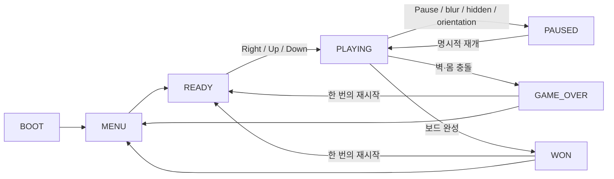
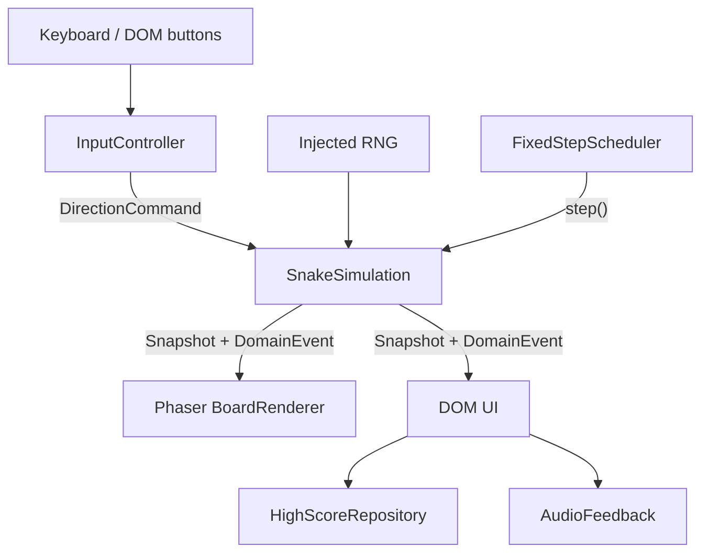

# Phaser Snake Game 개발 기획서

| 항목 | 내용 |
|---|---|
| 문서 버전 | 1.0-plan |
| 작성일 | 2026-07-15 |
| 대상 | 기획 승인자, Claude, Codex, Antigravity |
| 배포 목표 | GitHub Pages의 저장소 프로젝트 사이트 |
| 예상 공개 URL | `https://dragoncowkarma.github.io/snake-game/` |
| 현재 상태 | 계획 수립 완료, 구현 미착수 |

## 1. 결론 요약

이 프로젝트는 20×20 고정 그리드의 클래식 Snake를 모바일과 데스크톱에서 즉시 플레이할 수 있는 정적 웹 게임으로 만든다. 핵심 가치는 기능 수가 아니라 **예측 가능한 입력, 공정한 충돌, 빠른 재도전, 작은 화면에서도 정확한 조작**이다.

기술 구조는 다음 세 경계만 유지한다.

1. Phaser나 DOM을 모르는 순수 TypeScript 게임 코어
2. 코어 상태를 그리는 얇은 Phaser Scene
3. 메뉴·HUD·모바일 조작·상태 알림을 담당하는 HTML/CSS UI

Claude는 제품 명세·DOM UI·접근성·문서, Codex는 아키텍처·게임 코어·Phaser 통합·CI/CD, Antigravity는 독립 테스트 설계·브라우저/시각/접근성 QA를 맡는다. 구현자와 최종 검토자를 분리하고, GitHub Issue/PR을 실시간 공유 수단으로 사용한다.

Phaser 4.2.1을 우선 후보로 삼되, 출시 직후의 새 메이저라는 위험 때문에 기능 개발 전에 90분 기술 스파이크를 둔다. Phaser 4에 귀속되는 재현 실패일 때만 Phaser 3.90.0을 clean 구성해 같은 핵심 매트릭스를 검증한다. 환경·권한 문제는 후퇴가 아니라 `INCONCLUSIVE/BLOCKED`다.

## 2. 제품 목표와 성공 기준

### 2.1 목표 사용자

- 설치 없이 짧게 즐길 클래식 게임을 원하는 데스크톱·모바일 사용자
- 방향키/WASD 또는 화면 방향 버튼을 사용하는 사용자
- 빠른 속도가 어렵거나 동작 효과를 줄여야 하는 사용자

### 2.2 제품 목표

- 첫 방문자가 별도 설명 없이 10초 안에 플레이를 시작한다.
- 입력한 방향과 실제 이동 사이의 규칙이 일관되고 테스트 가능하다.
- 죽은 이유를 즉시 이해하고 한 번의 동작으로 다시 시작한다.
- 320×568 CSS px부터 데스크톱까지 보드와 조작부가 잘리지 않는다.
- GitHub Pages 하위 경로에서도 새로고침, JS/CSS 로드, 게임 실행이 정상이다.
- 네트워크, 계정, 서버 없이 로컬 최고 점수를 유지한다.

### 2.3 출시 후 확인할 지표

분석 SDK는 넣지 않고 5명 내외의 소규모 관찰 플레이테스트로 확인한다.

- 5명 중 4명 이상이 설명 없이 10초 안에 시작
- 5명 중 4명 이상이 첫 사망 원인을 정확히 설명
- 전원이 게임오버 뒤 2초 안에 재시작 방법 발견
- 모바일 반복 오입력 0회가 이상적이며, 반복되면 기능 추가보다 버튼 배치와 입력 큐를 먼저 수정

### 2.4 MVP 제외 범위

- 온라인 리더보드, 로그인, 서버 저장
- 멀티플레이, 일일 시드, 리플레이
- 장애물·벽 통과·독 먹이·파워업·콤보
- 스킨, 업적, 상점, 광고, 분석 SDK
- PWA와 오프라인 캐시
- 물리 엔진, React/Vue, Redux, ECS, 범용 이벤트 버스
- 배경음악, 복잡한 파티클, 진동, 카메라 흔들림

## 3. MVP 게임 명세

### 3.1 기본 규칙

| 항목 | 확정 제안 |
|---|---|
| 보드 | 20×20 논리 셀, 화면 크기에 따라 표시 크기만 변경 |
| 시작 | 길이 3, 오른쪽을 향한 `READY`; 오른쪽·위·아래 방향 입력 중 하나로 시작하고 반대인 왼쪽은 거부 |
| 이동 | 렌더 FPS와 독립된 고정 시뮬레이션 틱당 한 칸 |
| 벽 | 통과하지 않으며 머리가 경계를 넘으면 게임오버 |
| 자기 충돌 | 성장하지 않는 틱에는 빠져나갈 꼬리 셀로 이동 가능 |
| 먹이 | 항상 한 개, 빈 셀 목록에서 균등하게 선택 |
| 점수 | 먹이 한 개당 10점 |
| 성장 | 먹은 틱에 꼬리를 제거하지 않아 길이 한 칸 증가 |
| 승리 | 빈 셀이 없으면 음식 생성을 반복하지 않고 `WON` |
| 최고 점수 | 난이도별 `localStorage`; 실패 시 메모리 값으로 계속 진행 |
| 효과음 | 첫 사용자 제스처 이후 Web Audio로 짧게 합성, 음소거 가능 |

### 3.2 난이도

난이도 두 개는 단순 보너스가 아니라 운동·인지 접근성 수단이다. 수치는 하나의 설정 객체에만 둔다.

| 난이도 | 시작 속도 | 가속 | 최저 틱 | 최고 점수 키 |
|---|---:|---:|---:|---|
| 느림 | 220ms/칸 | 먹이 5개마다 10ms 감소 | 130ms | `slow` |
| 기본 | 160ms/칸 | 먹이 5개마다 10ms 감소 | 90ms | `normal` |

플레이테스트로 숫자는 조정할 수 있지만, 가속 공식과 두 모드 구조를 구현 중 임의로 바꾸지 않는다.

### 3.3 상태 흐름



- `MENU`: 난이도, 시작, 음소거를 선택한다.
- `READY`: 보드는 보이지만 움직이지 않는다. 오른쪽은 같은 방향이어도 **시작 명령으로 한 번 허용**하고, 위/아래는 방향을 바꾸며 시작하며, 왼쪽은 역방향이라 거부한다.
- `PLAYING`: 방향 명령만 게임 코어에 전달한다.
- `PAUSED`: 현재 진행 방향은 보존하되 방향 큐와 accumulator는 비운다. 방향 입력은 무시하고 명시적 재개만 받으며, 재개 시 accumulator 0에서 새 틱을 기다린다.
- `GAME_OVER`: 충돌 위치·원인을 짧게 강조한 뒤 최종/최고 점수와 재시작을 표시한다.
- `WON`: 게임오버와 구분된 완주 메시지를 표시한다.

### 3.4 입력 계약

| 동작 | 키보드 | 터치/포인터 |
|---|---|---|
| 이동 | 방향키, WASD | HTML 방향 버튼 |
| 메뉴 시작/확인 | Enter, Space | 시작 버튼 |
| 일시정지/재개 | P, Escape | 일시정지 버튼 |
| 재시작 | Enter, Space | 재시작 버튼 |
| 음소거 | M(보드 focus) 또는 음소거 버튼 | 음소거 토글 |

- 방향 큐는 최대 2개이며 한 시뮬레이션 틱에 하나만 소비한다.
- `PLAYING`에서는 현재 방향 또는 마지막 승인 예약 방향의 정반대 입력을 enqueue 시 거부한다.
- `PLAYING`에서는 같은 방향의 반복, `KeyboardEvent.repeat`, 멀티터치 중복을 무시한다. `READY`의 오른쪽 입력만 현재 방향과 같아도 시작 명령으로 특별 허용한다.
- 빠른 `오른쪽 → 위 → 왼쪽`은 두 틱에 걸쳐 허용한다.
- Enter/Space는 `MENU`의 시작과 `GAME_OVER/WON`의 재시작 버튼을 네이티브 활성화하며, `READY`를 직접 `PLAYING`으로 바꾸지 않는다.
- 스와이프는 MVP 필수가 아니며 추가하더라도 HTML 방향 버튼을 대체하지 않는다.

상태별 허용 명령은 다음 표를 권위 규칙으로 사용한다. 표에 없는 명령은 무시한다. 음소거는 모든 사용자 상태에서 허용한다.

| 현재 상태 | 허용 명령 | 결과 |
|---|---|---|
| `MENU` | 난이도 선택, Start, Mute | Start → `READY`; 방향키는 무시 |
| `READY` | Right/Up/Down, Mute | Right는 현재 방향으로, Up/Down은 회전해 `PLAYING`; Left/Enter/Space 무시 |
| `PLAYING` | 유효 방향, Pause, Mute | 방향 enqueue 또는 `PAUSED` |
| `PAUSED` | Resume, Mute | 방향 입력 무시; Resume → accumulator 0의 `PLAYING` |
| `GAME_OVER`/`WON` | Restart, Menu, Mute | Restart → 초기화된 `READY`; Menu → `MENU` |

모든 pause 진입은 현재 방향만 보존하고 방향 큐와 accumulator를 비운다. `document.hidden`, window blur, **실제 세로↔가로 방향 전환**만 자동 pause를 일으킨다. 주소창·키보드·컨테이너 크기 때문에 발생하는 일반 resize는 relayout만 하고 pause하지 않는다.

포커스와 입력 활성화 계약은 다음과 같다.

- 보드 Canvas를 설명이 연결되고 Tab으로도 도달 가능한 focus target(`tabindex="0"`)으로 둔다.
- Start/Resume 뒤에는 보드로 focus를 되돌린다. Pause 진입 시 Resume, `GAME_OVER/WON` 진입 시 Restart, Menu 진입 시 Start에 focus를 옮긴다.
- 이동/Pause/Mute 단축키는 focus가 보드에 있을 때만 직접 처리한다. 버튼에 focus가 있으면 Enter/Space의 네이티브 click만 사용해 이중 실행을 막는다.
- 처리해 실제 command로 변환한 보드 키만 `preventDefault`한다. 문서의 다른 영역은 방향키·Space로 계속 스크롤할 수 있어야 한다.
- HTML 방향 버튼은 `click` 한 경로만 command로 변환하고 `pointerdown`과 합성 click을 동시에 연결하지 않는다. 한 번 활성화는 command 정확히 한 개다.

### 3.5 피드백과 화면

- 먹이 획득 즉시 점수·길이를 갱신하고 짧은 윤곽 펄스와 효과음을 낸다.
- 충돌 셀을 약 300ms 동안 색상 외 윤곽/형태로 강조한다.
- 최고 점수 갱신은 게임 종료 화면에서만 강조한다.
- `prefers-reduced-motion: reduce`에서는 확대·이동 Tween 없이 윤곽과 텍스트만 사용한다.
- 초당 3회 이상 번쩍이는 효과를 만들지 않는다.
- 그래픽은 Phaser Graphics와 CSS로 생성하며 외부 이미지·폰트 요청이 없어야 한다.

### 3.6 반응형·접근성

- 세로 화면은 HUD → 정사각형 보드 → 방향 패드 순서다.
- 넓은 가로 화면은 보드와 조작부를 좌우로 배치할 수 있다.
- 방향 버튼은 실제 `<button>`이며 최소 44×44 CSS px, 권장 48×48px다.
- 게임 영역에만 `touch-action: none`을 적용하고 페이지 전체 스크롤을 막지 않는다.
- `env(safe-area-inset-*)`를 고려한다.
- 점수, 최고 점수, 상태, 종료 원인은 DOM 텍스트로 제공한다.
- 의미 있는 상태 변화만 `aria-live="polite"`로 알리고 매 이동 좌표는 읽지 않는다.
- 보이는 포커스 스타일과 키보드만으로 가능한 전체 흐름을 제공한다.
- 머리, 몸, 먹이, 충돌은 색상뿐 아니라 형태·테두리로 구분한다.
- 일반 텍스트 명암비 4.5:1, 큰 텍스트·UI 경계 3:1 이상을 목표로 한다.
- Canvas에 설명을 연결하되 무분별한 `role="application"`은 사용하지 않는다.
- 완전한 비시각적 동등 플레이를 보장한다고 표현하지 않고, 메뉴·상태·조작 접근성 범위를 정확히 문서화한다.

## 4. 수용 기준

### 4.1 게임 규칙

- `AC-G01`: `READY`에서는 시간이 지나거나 Enter/Space를 눌러도 움직이지 않는다. Right/Up/Down만 시작하고 Left는 거부된다.
- `AC-G02`: `READY`의 Right는 현재 방향 시작으로, Up/Down은 회전 시작으로 처리되고 이후 고정 틱당 정확히 한 칸 이동한다.
- `AC-G03`: 반대 방향은 단독·연속·멀티터치 상황 모두 거부된다.
- `AC-G04`: 30/60/120Hz 렌더 환경에서 같은 경과 시간의 논리 이동 결과가 같고, 가속 경계에서도 시작 시점의 `stepDuration`으로 시간을 차감한다.
- `AC-G05`: 먹이는 뱀과 겹치지 않고, 획득 시 점수와 길이가 한 번만 증가한다.
- `AC-G06`: 비성장 틱에는 빠져나갈 꼬리 셀로 이동할 수 있고 성장 틱에는 몸으로 판정한다.
- `AC-G07`: 벽·몸 충돌은 한 번만 종료를 일으키고 `gameEnded` event가 마지막 정상 머리와 시도한 충돌 좌표를 제공하며 UI가 원인과 충돌 지점을 표시한다.
- `AC-G08`: 느림/기본 속도 공식과 최고 점수가 분리되고, 5번째 먹이로 바뀐 속도는 다음 step부터 적용된다.
- `AC-G09`: 빈 셀이 없으면 무한 루프 없이 `WON`이 된다.
- `AC-G10`: 재시작 시 점수·길이·속도·먹이·입력 큐·accumulator가 초기화되고 리스너가 중복되지 않는다.

### 4.2 생명주기와 인터페이스

- `AC-L01`: 탭 숨김, 창 focus 상실, 실제 화면 방향 전환 시 자동 일시정지되고 임의 재개되지 않으며, 일반 resize만으로는 pause되지 않는다.
- `AC-L02`: 모든 pause 진입에서 현재 방향만 보존되고 방향 큐와 accumulator가 비워진다. pause 중 방향/delta는 상태를 바꾸지 않으며 resume은 accumulator 0에서 시작한다.
- `AC-L03`: 일반 resize 전후 논리 좌표, 점수, 진행 상태가 보존되고 relayout만 발생한다.
- `AC-U01`: 320×568에서 가로 스크롤, 버튼 겹침, 보드 잘림이 없다.
- `AC-U02`: 키보드만으로 메뉴부터 재시작까지 전 과정을 수행한다.
- `AC-U03`: 모든 터치 버튼에 접근 가능한 이름, 보이는 포커스, 44×44px 이상 영역이 있다.
- `AC-U04`: 색각에 의존하지 않고 머리·몸·먹이·충돌을 구분한다.
- `AC-U05`: 동작 줄이기와 음소거 상태에서도 정보가 손실되지 않는다.
- `AC-U06`: Start/Resume 뒤 보드, Pause 뒤 Resume, 종료 뒤 Restart로 focus가 이동하고, 키보드 전체 흐름에서 원치 않는 page scroll이 0이며 버튼 한 번 활성화는 command 한 개만 만든다.
- `AC-U07`: 점수·최고 점수·phase·종료 원인이 DOM에 있고, 의미 있는 상태/event당 live 알림은 최대 한 번이며 매 tick 알림은 0회다.
- `AC-U08`: 텍스트 대비 4.5:1, UI 경계와 필수 게임 그래픽 대비 3:1 이상이며 Canvas에 접근 가능한 설명이 연결된다.
- `AC-U09`: 320px와 모바일 safe area에서 조작부가 침범하지 않고, touch 동작 제한은 게임/D-pad에만 적용되어 문서의 나머지 영역은 스크롤된다.

### 4.3 복원력과 배포

- `AC-R01`: `localStorage`가 차단되거나 손상되어도 게임이 시작되고 플레이된다.
- `AC-R02`: 오디오 초기화 실패나 자동 재생 제한이 게임을 막지 않는다.
- `AC-R03`: `/snake-game/` 같은 Pages 하위 경로에서 문서, JS, CSS, 자산이 모두 200으로 로드된다.
- `AC-R04`: production build 실행 시 타입·lint·테스트·빌드 오류가 없다.
- `AC-R05`: 지원 브라우저에서 미처리 예외, 콘솔 오류, 실패한 런타임 요청이 없다.
- `AC-R06`: 20회 연속 재시작해도 중복 입력·속도 증가·이벤트 누적이 없다.

## 5. 기술 아키텍처

### 5.1 의존성 흐름



의존성 규칙은 한 방향이다.

- `src/domain/**`는 Phaser, DOM, Web Audio, `localStorage`를 import하지 않는다.
- Scene은 입력·시간·렌더링 어댑터를 조립하고 규칙을 결정하지 않는다.
- Canvas 픽셀을 읽어 충돌이나 점수를 판정하지 않는다.
- UI와 저장소는 snapshot/event를 소비하되 코어 상태를 직접 변형하지 않는다.

### 5.2 도메인 모델

예상 계약은 다음과 같으며 Wave 0에서 확정한다.

```ts
type Phase = 'menu' | 'ready' | 'playing' | 'paused' | 'gameOver' | 'won';
type Direction = 'up' | 'down' | 'left' | 'right';

interface Cell {
  readonly x: number;
  readonly y: number;
}

interface GameState {
  readonly phase: Phase;
  readonly snake: readonly Cell[]; // head first
  readonly direction: Direction;
  readonly queuedDirections: readonly Direction[];
  readonly food: Cell | null;
  readonly score: number;
  readonly foodsEaten: number;
  readonly tickMs: number;
  readonly difficulty: 'slow' | 'normal';
  readonly endReason: 'wall' | 'self' | null;
}

type DomainEvent =
  | { readonly type: 'foodEaten'; readonly cell: Cell; readonly score: number }
  | {
      readonly type: 'gameEnded';
      readonly reason: 'wall' | 'self';
      readonly headCell: Cell;       // 마지막 정상 머리
      readonly attemptedCell: Cell;  // 벽 밖 또는 몸과 겹친 시도 좌표
    }
  | { readonly type: 'gameWon'; readonly score: number };
```

음식은 성공할 때까지 임의 좌표를 반복하지 않고 최대 400개의 빈 셀 목록에서 선택한다. 셀 키는 `y * width + x`로 만들 수 있다. 동일 seed와 동일 명령열은 같은 snapshot과 event를 만들어야 한다. 자기 충돌은 `attemptedCell`을 강조하고, 벽 충돌은 `headCell`과 `attemptedCell`의 방향으로 맞닿은 보드 경계를 강조한다. Renderer가 충돌 규칙을 다시 계산해서는 안 된다.

한 틱의 처리 순서를 고정한다.

1. 방향 큐에서 최대 하나 적용
2. 다음 머리 계산
3. 벽 충돌 계산
4. 음식 섭취 여부 계산
5. 빠질 꼬리를 고려해 자기 충돌 계산
6. 머리 추가
7. 먹지 않았다면 꼬리 제거
8. 점수·속도 갱신
9. 필요하면 새 음식 생성 또는 승리 전환
10. 불변 snapshot과 domain event 반환

### 5.3 게임 루프

게임 규칙의 시계로 `setInterval`, Tween 완료, 렌더 프레임 수를 사용하지 않는다. Phaser `update(_, delta)`에서 accumulator 기반 fixed step을 실행한다.

```text
delta = min(delta, 250ms)
playing이면 accumulator += delta

현재 렌더 프레임의 step < 3인 동안:
  stepDuration = simulation.currentState.tickMs
  accumulator < stepDuration이면 중단
  simulation.step()
  accumulator -= stepDuration
  renderer/UI에 snapshot과 event 전달
```

step 시작 전에 캡처한 `stepDuration`을 조건과 차감에 똑같이 사용한다. 먹이로 갱신된 `tickMs`는 **다음 step부터** 적용한다. 탭 hidden/blur 또는 실제 orientation change에서는 즉시 pause하고 방향 큐와 accumulator를 비운다. 일반 resize는 relayout만 한다. 전경의 긴 정지에서도 한 프레임에 3틱을 넘지 않아 복귀 즉사를 막고, 재개는 사용자 입력으로만 한다.

### 5.4 Phaser Scene과 렌더링

- 기본은 `GameScene` 하나다. `READY/PLAYING/PAUSED/GAME_OVER/WON`은 Scene 수명 주기가 아니라 명시적 상태다.
- 로딩할 외부 이미지·음원이 없으므로 별도 `BootScene`은 만들지 않는다.
- 보드는 고정 논리 크기 480×480, 셀 24px로 그린다.
- `Scale.FIT`과 중앙 정렬을 사용하고 논리 좌표는 resize로 바꾸지 않는다.
- 최대 400칸이므로 `Phaser.GameObjects.Graphics` 재그리기로 충분하다.
- Arcade/Matter Physics를 사용하지 않는다.
- 보간을 추가하더라도 시각 좌표만 바꾸고 판정은 정수 셀만 사용한다.
- Phaser 4 초기화 실패 시 빈 화면 대신 DOM 오류 안내를 제공한다.

### 5.5 권장 파일 구조

```text
/
├── index.html
├── package.json
├── package-lock.json
├── tsconfig.json
├── vite.config.ts
├── eslint.config.js
├── .prettierrc
├── .nvmrc
├── AGENTS.md
├── .github/
│   ├── workflows/
│   │   ├── quality.yml
│   │   └── pages.yml
│   └── dependabot.yml
├── docs/
│   ├── DEVELOPMENT_PLAN.md
│   ├── TASKS.md
│   ├── AI_PROMPTS.md
│   ├── EXPERT_REVIEW.md
│   └── coordination/
├── src/
│   ├── main.ts
│   ├── styles.css
│   ├── config/game-config.ts
│   ├── domain/
│   │   ├── types.ts
│   │   ├── direction.ts
│   │   ├── snake-simulation.ts
│   │   ├── food-spawner.ts
│   │   └── random-source.ts
│   ├── game/
│   │   ├── GameScene.ts
│   │   ├── FixedStepScheduler.ts
│   │   ├── InputController.ts
│   │   └── BoardRenderer.ts
│   ├── ui/GameShell.ts
│   └── adapters/
│       ├── HighScoreRepository.ts
│       └── AudioFeedback.ts
├── tests/
│   ├── unit/
│   └── e2e/
└── public/favicon.svg
```

### 5.6 기술 스택과 버전 정책

| 구성 | 기준 | 정책 |
|---|---|---|
| Phaser | 4.2.1 우선, Phaser 귀책 시 검증된 3.90.0 | D-001 스파이크 뒤 MVP 동안 동결 |
| TypeScript | scaffold 시 최신 호환 안정판 | `strict: true`, lockfile 고정 |
| Vite | 8.1.x | 실제 패치 버전 lockfile 고정, 실험 기능 금지 |
| Node.js | 24.x LTS | `.nvmrc`, 로컬/CI 동일 major |
| 패키지 | npm | `package-lock.json` 커밋, CI는 `npm ci` |
| 단위 테스트 | Vitest | 도메인 중심 |
| 브라우저 테스트 | Playwright | production `dist` 대상 |
| 품질 | ESLint flat config, Prettier | 경고 무시 금지 |

`Sol/Terra/Luna`, `Fable 5` 같은 플랫폼 별칭의 상대 성능은 이름만으로 단정하지 않는다. 고정 fixture, hidden oracle, 독립 채점자가 준비된 경우에만 비차단 SG-000으로 적합도를 비교하고, 아니면 전문가 기반 잠정 라우팅을 유지한다.

## 6. GitHub Pages와 CI/CD

### 6.1 배포 구조

- GitHub Settings → Pages → Source를 `GitHub Actions`로 설정한다.
- PR의 `quality.yml`은 `contents: read`만 사용한다. Pages API를 호출하지 않고 현재 프로젝트 저장소 이름에서 `/<repo>/`를 산출해 format, lint, typecheck, unit, 해당 base build, Chromium smoke를 수행한다.
- `pages.yml`은 최초 공개 전에는 `workflow_dispatch`로만 실행하고 필수 40자리 `release_sha` 입력을 받는다. H3a가 승인한 SG-028 SHA와 정확히 같지 않으면 중단하며, branch 이름이나 움직이는 `main`을 배포 입력으로 허용하지 않는다. MVP 이후에도 기본은 명시적 수동 릴리스다.
- Pages build job은 `contents: read`, `pages: read`만 갖고 `configure-pages(id: pages) → base_path 후행 슬래시 정규화 → Vite --base build → upload-pages-artifact` 순서로 실행한다.
- build job은 `release_sha` 형식과 승인 값을 확인하고 정확한 commit을 checkout한 뒤 `git rev-parse HEAD`를 다시 대조한다. `dist/release.json`에 해당 SHA를 기록해 배포 artifact와 실제 사이트를 연결한다.
- deploy job은 build를 `needs`로 받고 `pages: write`, `id-token: write`만 갖는다. build job에 쓰기 권한을 주지 않는다.
- `github-pages` environment와 `concurrency: pages`를 사용한다.
- 전체 흐름은 `configure-pages → Vite build → upload-pages-artifact → deploy-pages`이며 `gh-pages` 브랜치에 `dist`를 커밋하지 않는다.
- 공식 Action은 구현 시점의 최신 공식 starter를 확인한 뒤 전체 commit SHA로 고정하고 Dependabot으로 갱신한다.
- Wave 1의 SG-009는 Pages base production preview와 업로드 가능한 artifact까지만 검증한다. 사람이 “기술 스파이크 URL도 즉시 공개된다”는 점을 별도로 승인하지 않는 한 deploy하지 않는다.

### 6.2 하위 경로

현재 origin 기준 예상 주소는 `https://dragoncowkarma.github.io/snake-game/`다. 일반적인 Pages 프로젝트 주소는 `https://<owner>.github.io/<repo>/`이며, `configure-pages`가 제공하는 base path를 `/` 또는 `/<repo>/`처럼 **후행 슬래시가 있는 형태로 정규화**해 Vite `--base`에 전달한다. 주소는 문서에 표시하되 빌드 설정에는 저장소 이름을 하드코딩하지 않는다. 로컬 기본값은 `/`다.

- `/assets/foo.png` 같은 루트 절대 런타임 경로 금지
- 정적 자산은 TypeScript/CSS import 또는 `import.meta.env.BASE_URL` 사용
- production preview도 Pages base로 빌드해 확인
- client router와 service worker를 사용하지 않아 fallback 문제를 만들지 않음

### 6.3 배포 후 검증과 롤백

- H3a 승인 SHA로 수동 배포하고 Actions 출력의 실제 `page_url`에 제한된 재시도로 HTTP 200 확인
- `${page_url}/release.json`의 SHA가 H3a 승인 SHA 및 workflow checkout SHA와 같은지 확인
- 문서, JS, CSS, favicon의 404와 브라우저 console error 검사
- 시작 → 이동 → pause → 재시작 스모크 수행
- 실패 시 직전 정상 commit 재배포 또는 revert 절차를 `README`에 기록

## 7. 3개 AI 에이전트 운영 설계

### 7.1 기본 책임

| AI | 주 책임 | 작성 범위 | 독립 검토 |
|---|---|---|---|
| Claude | 제품 명세, UX 문구, DOM UI, 접근성, 사용자 문서 | `docs` 제품 문서, `src/ui/**`, `src/styles.css` | Codex 도메인/아키텍처 |
| Codex | 기술 결정, scaffold, 도메인 코어, Phaser Scene, 통합, CI/Pages | `src/domain/**`, `src/game/**`, adapters, 설정, workflows | Claude UI 계약, Antigravity 테스트 코드 |
| Antigravity | 테스트 설계, 적대적 QA, Playwright, 시각·모바일·접근성 검증 | `tests/**`, QA 증거와 결함 보고 | Claude/Codex 결과 전체 |

구현자가 자기 결과를 최종 승인하지 않는다. Claude UI는 Antigravity가, Codex 코어/통합은 Claude와 Antigravity가, Antigravity 테스트 코드는 Codex가 검토한다.

### 7.2 상황 공유

- GitHub Issue: 작업 계약, 담당, 상태, blocker, 중간 진행, 수용 기준 증거
- PR: diff, 테스트, 리뷰, 최종 handoff
- `docs/coordination/STATUS.md`: 조정 책임자가 병합된 사실만 요약
- `docs/coordination/DECISIONS.md`: 승인된 제품·기술 계약
- handoff: branch/head SHA, 변경 파일, 실제 명령 결과, 위험, 다음 작업

AI끼리 직접 보낸 메시지는 알림일 뿐이다. 커밋 SHA와 Issue/PR 증거가 없으면 완료로 보지 않는다. 자세한 절차는 루트 `AGENTS.md`를 따른다.

### 7.3 모델 배정 원칙

- 낮음/light: 형식 정리, 상태 요약, 명칭 변경처럼 계약을 바꾸지 않는 기계적 작업
- 중간: 한 모듈, 명확한 수용 기준, 제한된 diff
- 높음: 여러 모듈, UI 상호작용, 테스트 설계
- 매우 높음/최대: 상태 머신, 배포, 공개 계약, 병합 충돌
- ultra/ultracode: 두 번 재현된 난해한 결함, 명세 충돌의 최종 분석, 릴리스 차단 통합에만 사용

상위 모델을 상시 사용하지 않는다. 같은 원인의 실패가 두 번 반복되면 먼저 증거·가설·시도 결과를 묶고, 그 패킷으로 한 단계만 에스컬레이션한다. 세 번째 추측성 수정은 금지한다.

세부 모델·설정·프롬프트 ID는 `docs/TASKS.md`, 복사 가능한 프롬프트는 `docs/AI_PROMPTS.md`에 있다.

## 8. 실행 순서와 사람 승인 지점

| Wave | 병렬 작업 | 핵심 산출물 | 종료 관문 |
|---|---|---|---|
| 0. 계약·검증 | 제품 AC, 선택적 모델 미니 벤치, Phaser 4 스파이크, QA 반대 검토 | 승인 가능한 규칙, D-001 증거, 공용 타입 | `H0b` 계약·결정 승인 |
| 1. 기반 구축 | scaffold/CI 뼈대, 도메인 계약, DOM shell, 테스트 설계 | Pages base로 빌드되는 artifact와 동결된 계약 | 자동 quality 통과, 실제 공개 없음 |
| 2. 수직 슬라이스 | 순수 코어, Phaser 렌더/입력, DOM HUD, 핵심 단위 테스트 | 시작→이동→먹기→죽기→재시작 | `H1` 모바일 시각/조작 승인 |
| 3. 기능 완성 | 난이도, pause/blur, 저장소, 오디오, 통합 | 전체 MVP 기능 | `H2` 사람 플레이테스트 |
| 4. 품질 강화 | Playwright, 접근성, 시각 회귀, 교차 브라우저, 결함 수정 | release candidate | 차단/높음 결함 0 |
| 5. 배포·릴리스 | Pages workflow, 문서, H3a 수동 배포, 실제 URL smoke, 롤백 | 공개 URL과 릴리스 증거 | `H3b` 사람 릴리스 수락 |

### 사람의 승인 관문

- `H0a`: 현재 계획, MVP·비목표·두 난이도, SG-001~004와 선택적 SG-000 실행을 승인한다. 아직 기술 선택을 확정하지 않는다.
- `H0b`: SG-001 명세, SG-002 선택 버전 증거, SG-003 계약, SG-004 테스트 맵과 D-001~D-006을 승인한다. Wave 1은 H0b 뒤에만 시작한다.
- `H1/H2`: 320px 모바일 UI와 실제 게임 감각을 플레이해 승인
- `H3a`: SG-028 Claude PASS가 있는 정확한 40자리 release candidate SHA, 라이선스, 문구, 롤백 계획을 기록하고 그 SHA의 최초 공개 수동 배포만 승인한다.
- `H3b`: 실제 Pages URL smoke와 잔여 위험을 확인하고 릴리스를 수락한다.

H0a 전에는 spike를 시작하지 않고, H0b 전에는 기능 구현을 시작하지 않는다. SG-009에서 별도 공개 승인을 받지 않는 한 H3a 전에는 Pages URL을 만들지 않는다.

## 9. 테스트 전략

### 9.1 자동화 계층

| 계층 | 도구 | 필수 범위 | 실행 시점 |
|---|---|---|---|
| 정적 검사 | Prettier, ESLint, TypeScript | 전체 소스·테스트 | 모든 PR |
| 단위 | Vitest | 이동, 역방향, 입력 큐, 성장, 꼬리 예외, 충돌, 음식, 만석 승리, 속도 하한, reset | 모든 PR |
| 계약 | Vitest | 동일 seed+명령열의 결정론, domain import 경계 | 모든 PR |
| E2E smoke | Playwright Chromium | 시작, 키 입력, 먹기, pause, restart, console/404 | 모든 PR |
| E2E matrix | Chromium, Firefox, WebKit | 모바일 viewport, 저장소 실패, blur/resize, 접근성 | 릴리스/야간 |
| 시각 회귀 | Playwright screenshot | 고정 seed의 menu/playing/gameOver, reduced motion | UI 변경/릴리스 |
| 배포 smoke | Playwright/HTTP | 실제 `page_url`과 Pages base | 배포 후 |

도메인 statement/branch coverage 90% 이상, 충돌·음식·입력 역전·만석 같은 위험 분기는 100%를 목표로 한다. 커버리지 숫자만으로 통과시키지 않고 모든 AC를 테스트 또는 수동 증거와 연결한다.

### 9.2 필수 경계 시나리오

1. `READY`에서 Enter/Space/Left는 정지하고 Right/Up/Down은 각각 명시된 방향으로 시작한다.
2. 오른쪽 이동 중 `위→왼쪽`이 두 틱에 걸쳐 적용된다.
3. 오른쪽 이동 중 `왼쪽`, 또는 `위→아래` 예약이 거부된다.
4. 먹이 직전 다중 입력에도 점수와 길이가 한 번만 증가한다.
5. 비성장 틱의 빠질 꼬리 셀 이동과 성장 틱의 동일 셀 충돌을 구분한다.
6. 벽/몸 충돌 event의 `headCell/attemptedCell`과 화면 강조 위치가 일치한다.
7. 유일한 빈 셀에 음식이 생성되고 만석에서는 즉시 승리한다.
8. 30/60/120Hz 조건에서 논리 결과가 같고 5번째 먹이 전 stepDuration으로 차감한다.
9. 탭을 5초 숨겼다가 돌아오면 queue가 비고 paused이며, 일반 resize만으로 pause되지 않는다.
10. 세로↔가로 실제 방향 전환 뒤 상태가 보존되고 명시적 resume을 기다린다.
11. Start/Resume/Pause/종료 전환마다 예상 control로 focus가 이동하고 page scroll이 생기지 않는다.
12. 방향 버튼 한 번의 pointer 활성화가 command 한 개만 만들고 페이지 나머지 영역은 스크롤된다.
13. `localStorage` 접근 예외와 손상 값에서 게임이 정상 시작한다.
14. score/best/phase/end reason DOM 값과 live 알림 횟수가 event와 일치한다.
15. 20회 재시작 뒤에도 입력·시간 이벤트가 한 번씩만 처리된다.

Antigravity는 한 번의 throwaway branch에서 핵심 검증 로직을 의도적으로 망가뜨려 테스트가 실제로 실패하는지 확인한다. 이 negative control은 제품 코드에 병합하지 않는다.

### 9.3 수동 환경

- viewport: 320×568, 390×844, 768×1024, 1366×768, 1920×1080
- 최신 안정판 Chrome, Edge, Firefox, Safari
- iOS Safari와 Android Chrome 실기기 각 1대 이상
- 키보드 전용, VoiceOver/TalkBack 기본 탐색, `prefers-reduced-motion`, 음소거

## 10. 비기능 기준

### 성능

- 400칸 상태에서도 대표 중급 모바일에서 60fps를 목표로 한다.
- 플레이 중 50ms 초과 long task가 반복되지 않는다.
- production 첫 로드의 gzip 전송량 1MB 이하를 목표로 한다.
- 런타임 외부 네트워크 요청은 0건이다.

### 보안·개인정보·공급망

- 사용자 식별 정보, 원격 분석, 쿠키, 서버 전송이 없다.
- `localStorage`에는 난이도별 최고 점수, 음소거, 마지막 난이도만 저장한다.
- DOM 문구는 `textContent`로 쓰고 사용자 HTML 삽입 경로를 만들지 않는다.
- GitHub Actions는 최소 권한과 전체 commit SHA pin을 사용한다.
- Dependabot과 GitHub dependency review로 npm/Actions 업데이트를 검토한다.
- lockfile 변경은 별도 설명과 clean `npm ci` 검증이 있어야 한다.

### 유지보수

- public 계약 변경은 결정 기록과 테스트를 함께 바꾼다.
- 함수·모듈은 도메인/게임/UI/어댑터 경계를 넘지 않는다.
- `dist`, Playwright 브라우저 바이너리, 보고서 생성물은 Git에 넣지 않는다.
- README의 로컬 실행·검증·배포 명령은 CI와 같아야 한다.

## 11. 주요 위험과 대응

| 위험 | 가능성/영향 | 예방 | 조기 경보와 대응 |
|---|---|---|---|
| Phaser 4 신생 메이저 API/타입 문제 | 중/높음 | 90분 스파이크, 정확 버전 고정 | Phaser 귀책이면 3.90.0 동일 matrix 검증; 환경 문제면 BLOCKED |
| AI가 Phaser 3/4 API 혼용 | 중/높음 | 공식 4.x 문서 링크, 버전 계약, 리뷰 | typecheck/공식 API 근거 없는 우회 PR 차단 |
| Pages base path 404 | 중/높음 | configure-pages base, 절대 경로 금지 | base production preview와 실제 URL smoke |
| background 복귀 즉사 | 중/높음 | hidden pause, delta clamp, step cap | lifecycle E2E 실패 시 출시 차단 |
| 빠른 입력 180도 회전 | 중/높음 | 마지막 승인 방향 기준 큐 검증 | 경계 단위 테스트 100% |
| 음식 생성 무한 루프 | 낮/높음 | 빈 셀 목록 방식 | 만석 테스트와 timeout |
| Scene reset 리스너 누적 | 중/중 | Scene 유지 + simulation reset | 20회 restart E2E |
| 모바일 스크롤/잘림 | 중/중 | DOM D-pad, scoped touch-action | 320px와 실기기 H1 검토 |
| 저장소/오디오 예외 | 중/낮음 | try/catch와 no-op fallback | 실패 주입 E2E |
| AI 간 계약 드리프트 | 중/높음 | contract-first, 파일 소유권, 단일 integrator | 계약 diff는 별도 PR/결정 필요 |
| 테스트가 구현 오류를 그대로 답습 | 중/높음 | 다른 AI 계열 QA, negative control | 테스트 mutation이 실패하지 않으면 suite 보강 |
| 과도한 기능 추가 | 중/중 | 비목표와 AC 고정 | 새 기능 PR은 H0b 이후 별도 승인 |

## 12. 출시 완료 정의

다음을 모두 만족해야 MVP 1.0이다.

- D-001 버전 결정과 모든 제품 결정이 `accepted`다.
- `AC-G01~G10`, `AC-L01~L03`, `AC-U01~U09`, `AC-R01~R06`에 자동 또는 수동 증거가 있다.
- format, lint, typecheck, unit, build, E2E가 clean checkout에서 통과한다.
- blocker/high 결함이 0이고 medium은 문서화해 사람이 수용했다.
- 최신 지원 브라우저와 핵심 viewport 수동 검토가 완료됐다.
- Pages 실제 URL에서 200, console error 0, asset 404 0이다.
- 공개 `release.json`에 기록된 source SHA, H3a 승인 SHA, workflow checkout SHA가 일치한다.
- `dist`가 Git에 없고 라이선스·의존성 고지가 맞다.
- README의 실행/테스트/배포/롤백 절차를 다른 AI가 재현했다.
- 최종 배포 SHA에 Antigravity SG-026 `PASS`, Claude SG-028 `PASS`, Codex SG-027 clean `PASS`와 사람 H3b 수락이 있다.

## 13. 예상 일정

전체 규모는 약 4~5 개발자일 상당이다. 계약 동결 뒤 세 AI를 병렬로 운용하면 사람 승인과 외부 권한 대기 시간을 제외하고 2~3일의 경과 시간으로 계획한다. 일정은 시간이 아니라 Wave의 증거와 종료 관문으로 관리한다.

- Day 1: Wave 0~1, 버전/계약/첫 Pages 경로 수직 슬라이스
- Day 2: Wave 2~3, 플레이 가능한 MVP와 H1/H2
- Day 3: Wave 4~5, 교차 브라우저·접근성·H3a 배포·H3b 수락

버전 스파이크나 실제 Pages 권한이 막히면 일정을 압축하지 않고 해당 gate에서 멈춘다.

## 14. 공식 근거

- [Phaser 설치 문서](https://docs.phaser.io/phaser/getting-started/installation)
- [Phaser 공식 Vite TypeScript 템플릿](https://github.com/phaserjs/template-vite-ts)
- [Phaser 릴리스 아카이브](https://phaser.io/download/archive)
- [Phaser 4 변경 기록](https://github.com/phaserjs/phaser/blob/master/changelog/v4/4.0/CHANGELOG-v4.0.0.md)
- [Vite 8.1 발표와 지원 정책](https://vite.dev/blog/announcing-vite8-1)
- [Vite의 GitHub Pages 배포 가이드](https://vite.dev/guide/static-deploy.html)
- [Node.js 릴리스 현황](https://nodejs.org/en/about/previous-releases)
- [GitHub Pages custom workflow](https://docs.github.com/en/pages/getting-started-with-github-pages/using-custom-workflows-with-github-pages)
- [GitHub Actions Node.js build/test](https://docs.github.com/en/actions/tutorials/build-and-test-code/nodejs)
- [WCAG 2.2](https://www.w3.org/TR/WCAG22/)
